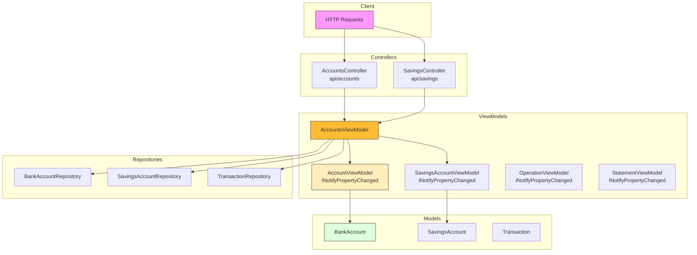

# Architecture MVVM - BankingKata-MVVM

### Pattern MVVM

- **Model** : Données métier (BankAccount, SavingsAccount, Transaction)
- **View** : Controllers API → JSON
- **ViewModel** : 
  - `AccountsViewModel` - Logique métier centralisée
  - ViewModels avec `INotifyPropertyChanged` pour binding bidirectionnel

### Caractéristiques MVVM

1. ViewModels implémentent `INotifyPropertyChanged`
2. Propriétés avec setter qui appelle `OnPropertyChanged()`
3. ViewModels gèrent la logique métier (pas les Controllers)
4. Controllers délèguent au ViewModel