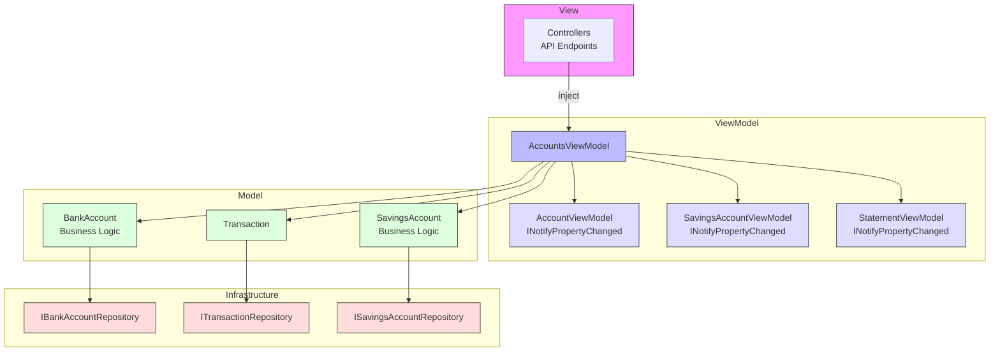
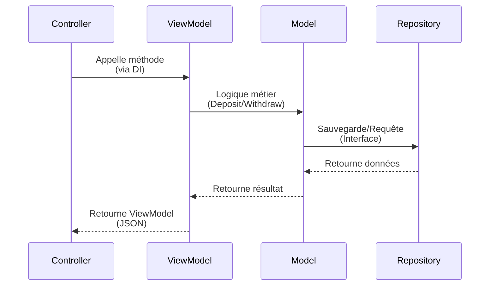

# BankingKata-MVVM

API Bancaire en .NET 8 utilisant le pattern **MVVM (Model-View-ViewModel)** avec injection de dépendances.

## Architecture

```
BankingKata-MVVM/
├── Models/           # Modèles de domaine (Business Logic)
│   └── AccountModels.cs      # BankAccount, SavingsAccount, Transaction
├── Repositories/     # Accès aux données (via interfaces)
│   └── Repositories.cs       # IBankAccountRepository, ITransactionRepository, ISavingsAccountRepository
├── ViewModels/      # ViewModels avec INotifyPropertyChanged et ObservableCollection
│   ├── AccountViewModels.cs   # AccountViewModel, StatementViewModel, etc.
│   └── AccountsViewModel.cs  # Logique métier avec DI
├── Controllers/      # Contrôleurs API (injection du ViewModel)
│   ├── AccountsController.cs
│   └── SavingsController.cs
└── Program.cs        # Configuration DI
```

## Pattern MVVM

- **Model** : `Models/AccountModels.cs` - Données et logique métier
- **View** : Controllers API qui retournent des ViewModels en JSON
- **ViewModel** : `ViewModels/AccountsViewModel.cs` - État observable avec `INotifyPropertyChanged` et `ObservableCollection`

### Injection de Dépendances

Le ViewModel et les Repositories sont injectés via le constructeur :

```csharp
public class AccountsController : ControllerBase
{
    private readonly AccountsViewModel _viewModel;

    public AccountsController(AccountsViewModel viewModel)
    {
        _viewModel = viewModel;
    }
}
```

Les services sont configurés dans `Program.cs` :

```csharp
builder.Services.AddSingleton<IBankAccountRepository, BankAccountRepository>();
builder.Services.AddSingleton<ITransactionRepository, TransactionRepository>();
builder.Services.AddSingleton<ISavingsAccountRepository, SavingsAccountRepository>();
builder.Services.AddTransient<AccountsViewModel>();
```

## Schéma de l'Architecture MVVM



## Flux de Données



## ViewModels avec PropertyChanged et ObservableCollection

Les ViewModels implémentent `INotifyPropertyChanged` pour supporter la liaison de données bidirectionnelle, et utilisent `ObservableCollection` pour la réactivité :

```csharp
public class AccountViewModel : INotifyPropertyChanged
{
    private string _accountNumber;
    public string AccountNumber
    {
        get => _accountNumber;
        set { _accountNumber = value; OnPropertyChanged(); }
    }
    
    public event PropertyChangedEventHandler? PropertyChanged;
    protected void OnPropertyChanged([CallerMemberName] string? propertyName = null)
        => PropertyChanged?.Invoke(this, new PropertyChangedEventArgs(propertyName));
}
```

Collections réactives :

```csharp
public class AccountsViewModel
{
    public AccountsViewModel(
        IBankAccountRepository bankAccountRepo,
        ITransactionRepository transactionRepo,
        ISavingsAccountRepository savingsRepo)
    {
        // Injection via constructeur
    }

    public ObservableCollection<AccountViewModel> Accounts { get; } = new();
    public ObservableCollection<SavingsAccountViewModel> SavingsAccounts { get; } = new();
}
```

## Endpoints

### Comptes Courants
| Méthode | Endpoint | Description |
|---------|----------|-------------|
| GET | `/api/accounts` | Liste tous les comptes |
| GET | `/api/accounts/{accountNumber}` | Détails d'un compte |
| POST | `/api/accounts` | Créer un compte |
| POST | `/api/accounts/{accountNumber}/deposit` | Déposer de l'argent |
| POST | `/api/accounts/{accountNumber}/withdraw` | Retirer de l'argent |
| POST | `/api/accounts/{accountNumber}/overdraft` | Modifier le découvert |
| GET | `/api/accounts/{accountNumber}/statement` | Relevé de compte |

### Livrets Épargne
| Méthode | Endpoint | Description |
|---------|----------|-------------|
| GET | `/api/savings` | Liste tous les livrets |
| GET | `/api/savings/{accountNumber}` | Détails d'un livret |
| POST | `/api/savings` | Créer un livret |
| POST | `/api/savings/{accountNumber}/deposit` | Déposer |
| POST | `/api/savings/{accountNumber}/withdraw` | Retirer |

## Exemples de Requêtes

```bash
# Créer un compte
curl -X POST http://localhost:5000/api/accounts \
  -H "Content-Type: application/json" \
  -d '{"accountNumber": "ACC001", "initialBalance": 1000, "overdraftLimit": 500}'

# Déposer de l'argent
curl -X POST http://localhost:5000/api/accounts/ACC001/deposit \
  -H "Content-Type: application/json" \
  -d '{"amount": 500}'

# Obtenir le relevé
curl http://localhost:5000/api/accounts/ACC001/statement
```

## Lancer le Projet

```bash
cd BankingKata-MVVM
dotnet run
```

L'API sera disponible sur `http://localhost:5000`
Swagger disponible sur `http://localhost:5000/swagger`