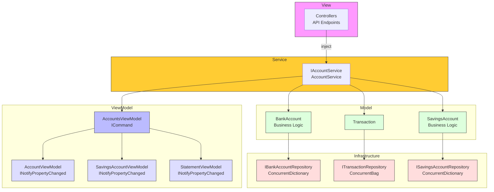
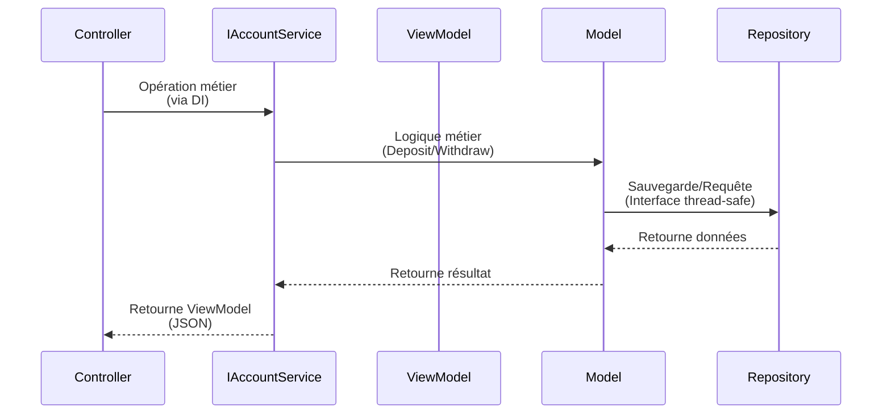

# BankingKata-MVVM

API Bancaire en .NET 8 utilisant le pattern **MVVM (Model-View-ViewModel)** avec injection de dépendances.

## Architecture

```
BankingKata-MVVM/
├── Models/              # Modèles de domaine (Business Logic)
│   └── AccountModels.cs           # BankAccount, SavingsAccount, Transaction
├── Repositories/       # Accès aux données (thread-safe via interfaces)
│   └── Repositories.cs            # IBankAccountRepository, ITransactionRepository, ISavingsAccountRepository
├── Services/           # Couche Service (logique métier)
│   └── AccountService.cs         # IAccountService - orchestre les opérations
├── Commands/           # ICommand pattern pour MVVM
│   └── RelayCommand.cs           # RelayCommand, RelayCommand<T>
├── ViewModels/        # ViewModels avec INotifyPropertyChanged et ICommand
│   ├── AccountViewModels.cs       # AccountViewModel, StatementViewModel, etc.
│   └── AccountsViewModel.cs      # Logique UI avec ObservableCollection
├── Controllers/       # Contrôleurs API (utilisent IAccountService)
│   ├── AccountsController.cs
│   └── SavingsController.cs
└── Program.cs         # Configuration DI
```

## Pattern MVVM

- **Model** : `Models/AccountModels.cs` - Données et logique métier
- **View** : Controllers API qui retournent des ViewModels en JSON
- **ViewModel** : `ViewModels/AccountsViewModel.cs` - État observable avec `INotifyPropertyChanged`, `ObservableCollection` et `ICommand`

### Architecture MVVM avec Couche Service

```
Controller API → IAccountService (Service)
                      ↓
                 ViewModel (Commands)
                      ↓
                 Repositories (thread-safe)
                      ↓
                 Models
```

### Injection de Dépendances

Les controllers injectent `IAccountService` qui encapsule la logique métier :

```csharp
public class AccountsController : ControllerBase
{
    private readonly IAccountService _accountService;

    public AccountsController(IAccountService accountService)
    {
        _accountService = accountService;
    }
}
```

Les services sont configurés dans `Program.cs` :

```csharp
builder.Services.AddSingleton<IBankAccountRepository, BankAccountRepository>();
builder.Services.AddSingleton<ITransactionRepository, TransactionRepository>();
builder.Services.AddSingleton<ISavingsAccountRepository, SavingsAccountRepository>();
builder.Services.AddTransient<IAccountService, AccountService>();
```

## Schéma de l'Architecture



## Flux de Données



## Thread-Safety

Les repositories utilisent `ConcurrentDictionary` et `ConcurrentBag` :

```csharp
public class BankAccountRepository : IBankAccountRepository
{
    private readonly ConcurrentDictionary<string, BankAccount> _accounts = new();
}

public class TransactionRepository : ITransactionRepository
{
    private readonly ConcurrentBag<Transaction> _transactions = new();
}
```

## ICommand Pattern

```csharp
public class AccountsViewModel
{
    public AccountsViewModel(IAccountService accountService)
    {
        _accountService = accountService;

        AddAccountCommand = new RelayCommand<CreateAccountViewModel>(AddAccount);
        DepositCommand = new RelayCommand<DepositCommandParameter>(Deposit);
    }

    public ICommand AddAccountCommand { get; }
    public ICommand DepositCommand { get; }
}
```

## Validation (DataAnnotations)

```csharp
public class CreateAccountViewModel
{
    [Required]
    [StringLength(20, MinimumLength = 1)]
    public string AccountNumber { get; set; } = string.Empty;

    [Range(0, double.MaxValue)]
    public decimal OverdraftLimit { get; set; }
}
```

## Endpoints

### Comptes Courants
| Méthode | Endpoint | Description |
|---------|----------|-------------|
| GET | `/api/accounts` | Liste tous les comptes |
| GET | `/api/accounts/{accountNumber}` | Détails d'un compte |
| POST | `/api/accounts` | Créer un compte |
| POST | `/api/accounts/{accountNumber}/deposit` | Déposer |
| POST | `/api/accounts/{accountNumber}/withdraw` | Retirer |
| POST | `/api/accounts/{accountNumber}/overdraft` | Modifier découvert |
| GET | `/api/accounts/{accountNumber}/statement` | Relevé |

### Livrets Épargne
| Méthode | Endpoint | Description |
|---------|----------|-------------|
| GET | `/api/savings` | Liste tous les livrets |
| GET | `/api/savings/{accountNumber}` | Détails |
| POST | `/api/savings` | Créer |
| POST | `/api/savings/{accountNumber}/deposit` | Déposer |
| POST | `/api/savings/{accountNumber}/withdraw` | Retirer |

## Lancer

```bash
cd BankingKata-MVVM
dotnet run
```

API : `http://localhost:5000`  
Swagger : `http://localhost:5000/swagger`

## Tests

```bash
dotnet test
```
