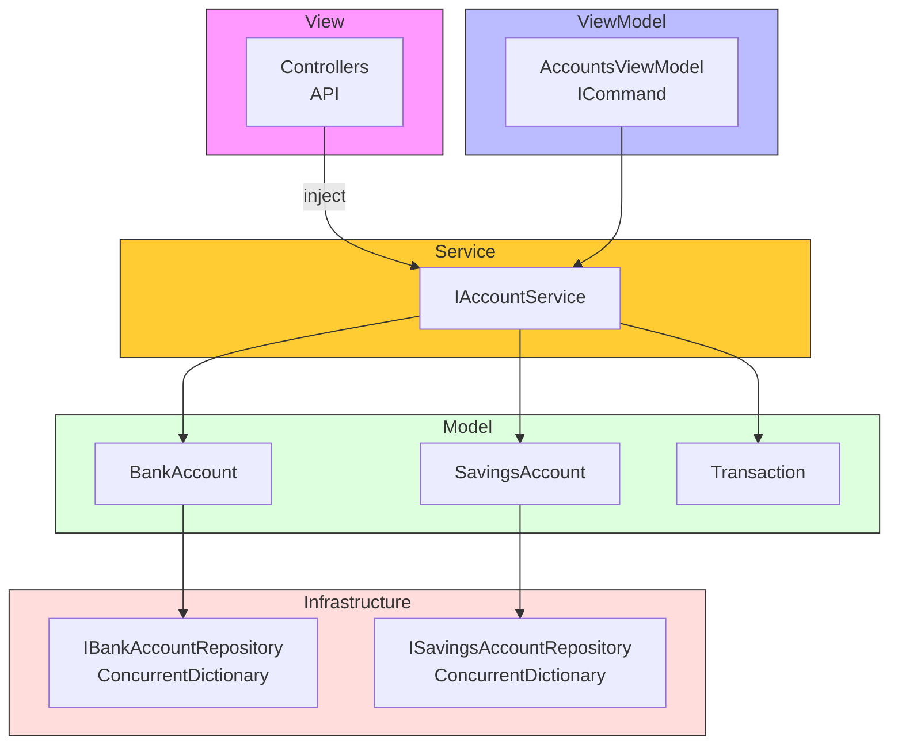
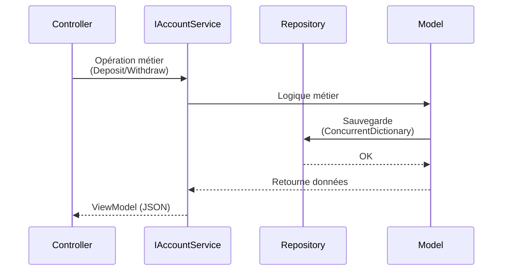

# BankingKata-MVVM

API Bancaire en .NET 8 utilisant le pattern **MVVM (Model-View-ViewModel)** avec injection de dépendances.

## Architecture

```
BankingKata-MVVM/
├── Models/              # Modèles de domaine (Business Logic)
├── Repositories/       # Accès aux données (thread-safe via interfaces)
├── Services/           # Couche Service (logique métier)
├── Commands/           # ICommand pattern pour MVVM
├── ViewModels/        # ViewModels avec INotifyPropertyChanged
├── Controllers/       # Contrôleurs API (utilisent IAccountService)
└── Program.cs         # Configuration DI
```

## Pattern MVVM

- **Model** : Données et logique métier (BankAccount, SavingsAccount, Transaction)
- **View** : Controllers API qui retournent des ViewModels en JSON
- **ViewModel** : État observable avec `INotifyPropertyChanged` et `ICommand`

### Architecture MVVM avec Couche Service

```
Controller API → IAccountService → Repositories → Models
                                           ↓
                                    ViewModels (pour UI XAML)
```

### Injection de Dépendances

```csharp
public class AccountsController : ControllerBase
{
    private readonly IAccountService _accountService;

    public AccountsController(IAccountService accountService)
    {
        _accountService = accountService;
    }
}
```

```csharp
builder.Services.AddSingleton<IBankAccountRepository, BankAccountRepository>();
builder.Services.AddSingleton<ITransactionRepository, TransactionRepository>();
builder.Services.AddSingleton<ISavingsAccountRepository, SavingsAccountRepository>();
builder.Services.AddTransient<IAccountService, AccountService>();
```

## Schéma de l'Architecture



## Flux de Données (API)



## Thread-Safety

```csharp
public class BankAccountRepository : IBankAccountRepository
{
    private readonly ConcurrentDictionary<string, BankAccount> _accounts = new();
}
```

## ICommand Pattern

```csharp
public class AccountsViewModel
{
    public AccountsViewModel(IAccountService accountService)
    {
        AddAccountCommand = new RelayCommand<CreateAccountViewModel>(AddAccount);
        DepositCommand = new RelayCommand<DepositCommandParameter>(Deposit);
    }

    public ICommand AddAccountCommand { get; }
    public ICommand DepositCommand { get; }
}

// Paramètres de commande
public class DepositCommandParameter
{
    public string AccountNumber { get; set; }
    public decimal Amount { get; set; }
}
```

## Validation

```csharp
public class CreateAccountViewModel
{
    [Required]
    [StringLength(20, MinimumLength = 1)]
    public string AccountNumber { get; set; }
}
```

## Endpoints

### Comptes Courants
| Méthode | Endpoint | Description |
|---------|----------|-------------|
| GET | `/api/accounts` | Liste tous les comptes |
| GET | `/api/accounts/{accountNumber}` | Détails |
| POST | `/api/accounts` | Créer |
| POST | `/api/accounts/{accountNumber}/deposit` | Déposer |
| POST | `/api/accounts/{accountNumber}/withdraw` | Retirer |
| POST | `/api/accounts/{accountNumber}/overdraft` | Modifier découvert |
| GET | `/api/accounts/{accountNumber}/statement` | Relevé |

### Livrets Épargne
| Méthode | Endpoint | Description |
|---------|----------|-------------|
| GET | `/api/savings` | Liste |
| GET | `/api/savings/{accountNumber}` | Détails |
| POST | `/api/savings` | Créer |
| POST | `/api/savings/{accountNumber}/deposit` | Déposer |
| POST | `/api/savings/{accountNumber}/withdraw` | Retirer |

## Lancer

```bash
cd BankingKata-MVVM
dotnet run
```

API : `http://localhost:5000`  
Swagger : `http://localhost:5000/swagger`

## Tests

```bash
dotnet test
```

19 tests passent (AccountsViewModelTests, SavingsViewModelTests)